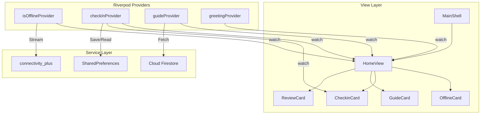

# Wellness App

A modern, beautifully designed Flutter wellness application that provides users with a peaceful dashboard, weekly check-ins, and curated guide contents fetched directly from Google Cloud Firestore. The app features state-of-the-day greetings, connectivity monitoring with custom offline banners, and a bottom navigation structure.

---

## 🚀 Setup Instructions

### Prerequisites
- **Flutter SDK**: `^3.12.1` or higher.
- **Dart SDK**: `^3.12.1` or higher.
- **Firebase CLI**: Installed and logged in (`firebase login`).
- **CocoaPods** (for iOS/macOS builds): Installed on your machine.

### Local Installation

1. **Clone the Repository**
   ```bash
   git clone <repository_url>
   cd wellness_app
   ```

2. **Get Dependencies**
   Run the following command to download and install all Dart and Flutter dependencies:
   ```bash
   flutter pub get
   ```

3. **Firebase & Firestore Configuration**
   The application uses Firebase services. The Firebase configurations are stored in the generated file `lib/firebase_options.dart`. To configure or reconfigure your Firebase project settings:
   - Make sure the FlutterFire CLI is installed: `dart pub global activate flutterfire_cli`
   - Run the FlutterFire configuration tool:
     ```bash
     flutterfire configure --project=wellness-app-46550
     ```
   - Select the target platforms (Android, iOS, macOS, Windows, Web). This will automatically update your `google-services.json` and `GoogleService-Info.plist` files.

4. **Running the Application**
   To launch the application on a connected device or emulator:
   ```bash
   flutter run
   ```

---

## 🗄️ Cloud Firestore Schema

The app fetches guide details dynamically from Cloud Firestore. Below is the configuration and schema for the Firestore database.

### `guides` Collection
This collection stores details of all the guides displayed on the home dashboard.

| Field Name | Data Type | Description |
| :--- | :--- | :--- |
| `title` | `String` | The title of the guide (e.g. `"The first sleepless month"`). Supports `\n` characters for multi-line formatting. |
| `description` | `String` | Brief summary of the guide. Can include duration info (e.g. `"A short read on what no one tells you. 6 min."`). |
| `imageUrl` | `String` | HTTPS URL pointing to the guide's background image asset (e.g. stored in Cloudinary/Firebase Storage). |
| `isPaid` | `Boolean` | True if the guide is a premium/paid content; false if free. |
| `isActive` | `Boolean` | Flag to enable or disable displaying the guide in the feed. |
| `price` | `Number (Integer)` | The cost of the guide (if `isPaid` is true). |
| `createdAt` | `Timestamp` | Firestore Timestamp indicating when the guide was added. |

---

## 📐 App Design System

The app utilizes a premium, minimal aesthetic with curated typography and responsive layout spacing.

- **Colors**:
  - Background: Off-white (`Color(0xFFF5F5F5)`)
  - Accent/Foreground: Matte Black (`Color(0xCC000000)` / `Colors.black`)
  - Labels & Subtitles: Dark grey / muted colors (`Color(0xFF6B6B6B)` / `Colors.black45`)
  - Offline Card: Light cream (`Color(0xFFF9F9F9)`) with thin gray bottom border (`Color(0xFFE5E5E5)`)
- **Typography**:
  - Secondary / Editorial Font: `GoogleFonts.newsreader` (used for greetings, titles, labels, and check-in content).
  - Primary / UI Font: `GoogleFonts.workSans` (used for app badges, offline state notifications).
  - Greeting Subtitle: `GoogleFonts.caveat` (for handwriting style micro-animations).

---

## 🛠️ Low-Level Design (LLD) Architecture

The application is structured following clean architecture principles, utilizing **Flutter Riverpod** for state management and reactive dependency injection.

### Directory Structure
```
lib/
├── firebase_options.dart      # Auto-generated Firebase configurations
├── home_view.dart             # Main home dashboard screen
├── main.dart                  # Application entry point
├── main_shell.dart            # Scaffold layout with bottom navigation
├── model/                     # Data models
│   ├── greeting_model.dart    # Schema for check-in greeting content
│   └── guide_model.dart       # Schema for Firestore-sourced guide entries
├── provider/                  # Riverpod states and business logic
│   ├── checkin_provider.dart  # Local check-in state notifier (SharedPreferences)
│   ├── connectivity_provider.dart # Live network status monitoring stream
│   ├── guide_provider.dart    # FutureProvider querying Firestore guides
│   ├── home_view_provider.dart# Greeting message notifier (time-of-day logic)
│   └── tab_provider.dart      # Navigation state
└── widgets/                   # Reusable UI component blocks
    ├── bottom_navbar.dart     # Bottom navigation tabs bar
    ├── checkin_card.dart      # Weekly check-in questionnaire entry
    ├── guide_card.dart        # Firestore content guide layout
    ├── offline_card.dart      # Network offline banner overlay
    └── review_card.dart       # Community feedback review card
```

### Component Flow



### Key Modules & Flow Logic

#### 1. Network Spacing Optimization
When the network status transitions to offline, `isOfflineProvider` emits `true` and the `OfflineCard` is displayed above the scrolling view. To prevent double padding, the `SliverAppBar` sets `primary: !isOffline`, letting the `OfflineCard` occupy the top safe area of the screen without pushing the AppBar down unnecessarily.

#### 2. Weekly Check-In Logic
- **Not Done State**: The home screen shows the `CheckinCard` ("Five quiet minutes").
- **Done State**: Once completed (stored in `SharedPreferences`), `checkInProvider` updates and:
  - Displays a "Done for the week" state on the home screen.
  - Reveals the `ReviewCard` ("From Your Community").
  - Dynamically updates the guides header section from "THIS WEEK'S GUIDES" to "PICK UP WHERE YOU LEFT OFF".
